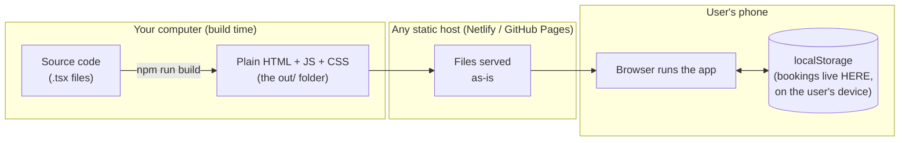
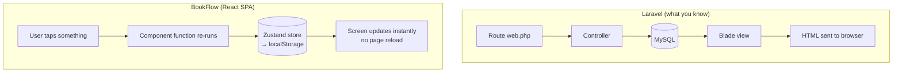
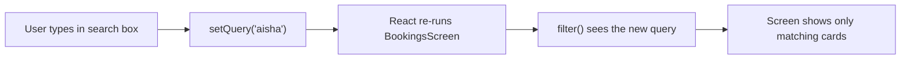
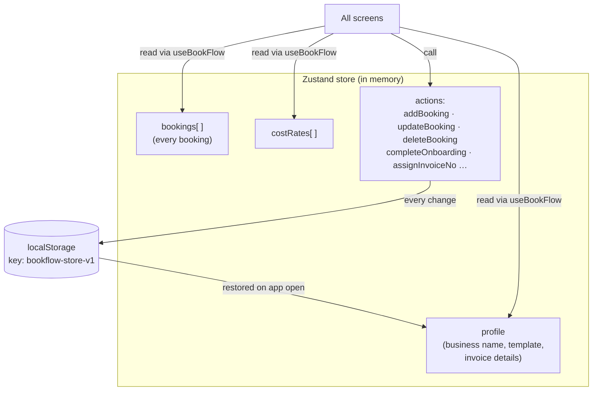
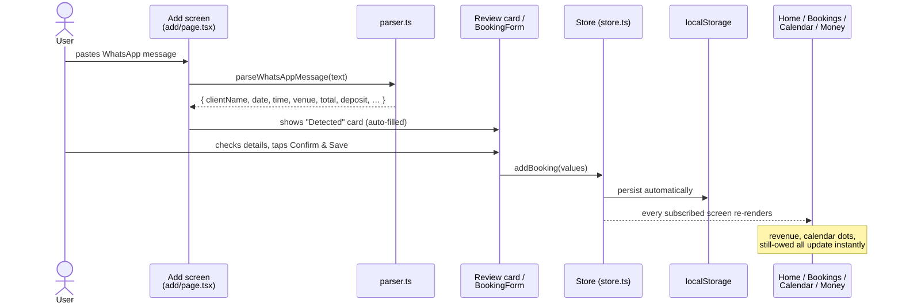
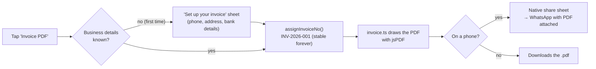
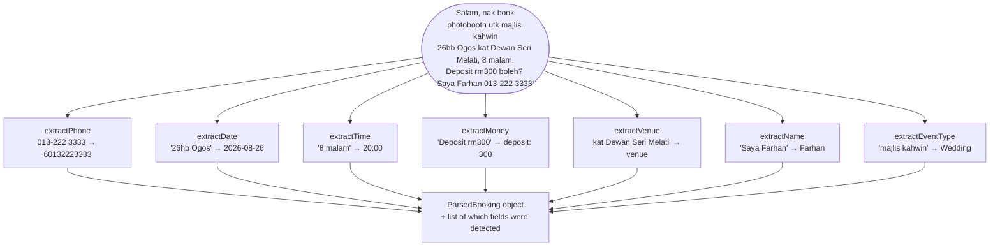
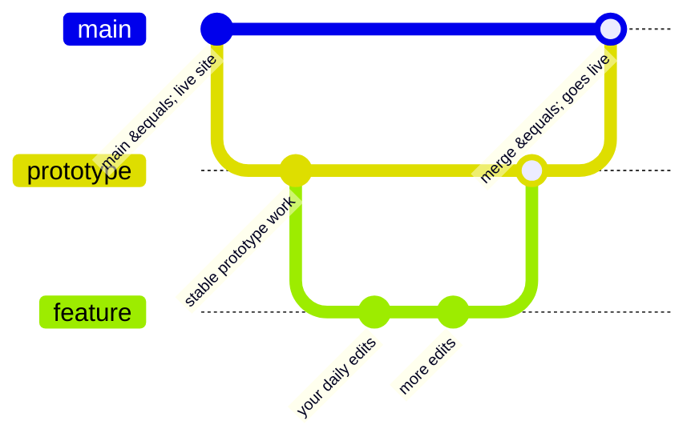

# 📚 Learn the BookFlow Code — From Absolute Zero

This guide assumes you know **nothing** about JavaScript, TypeScript, React,
Next.js, or Tailwind. It uses what you *do* know (a bit of Laravel, some Java)
as stepping stones. Read it top to bottom once, then keep it open as a
reference while you poke at the code.

> **Tip:** GitHub renders the diagrams in this file. Read it at
> https://github.com/ShaqIshan/bookflow/blob/main/LEARN-THE-CODE.md for the
> full experience.

---

## Table of contents

1. [The big picture — what even is this app?](#1-the-big-picture)
2. [Meet the technologies (with Laravel/Java translations)](#2-meet-the-technologies)
3. [JavaScript & TypeScript crash course](#3-javascript--typescript-crash-course)
4. [React from zero](#4-react-from-zero)
5. [Next.js — how folders become pages](#5-nextjs--how-folders-become-pages)
6. [Tailwind — how the app is styled](#6-tailwind--how-the-app-is-styled)
7. [The store — the app's memory](#7-the-store--the-apps-memory)
8. [How data flows through the whole app](#8-how-data-flows)
9. [Guided tour — every file explained](#9-guided-tour--every-file-explained)
10. [Deep dive — reading a real screen line by line](#10-deep-dive--reading-a-real-screen)
11. [Deep dive — the WhatsApp parser (the hero)](#11-deep-dive--the-whatsapp-parser)
12. [Recipes — make changes yourself](#12-recipes--make-changes-yourself)
13. [Git & deploy cheat sheet](#13-git--deploy-cheat-sheet)
14. [Glossary A–Z](#14-glossary)

---

## 1. The big picture

BookFlow has **no server and no database**. That sounds impossible coming from
Laravel, where everything lives on a server — so start here:



**In Laravel terms:** imagine if `php artisan` compiled your entire app —
routes, controllers, Blade views, *and* the database — into a folder of static
files, and the "database" was a small key-value store inside each visitor's
browser. That's this app.

- **Build time** (`npm run build`): Next.js reads all our code and produces
  ready-made HTML/JS in `bookflow-app/out/`.
- **Run time** (user opens the site): the browser downloads that JS, and React
  takes over the page — drawing screens, reacting to taps.
- **Storage**: every booking is saved to the browser's `localStorage`
  (a tiny built-in key-value database, ~5MB, survives closing the tab).
  Nothing ever leaves the phone. That's why there's no login.

**Why build it this way?** For a validation-stage prototype it means: free
hosting, zero security surface, works offline, and testers don't need
accounts. The trade-off: data doesn't sync between devices (that's the future
Supabase/backend step, noted in the README).

---

## 2. Meet the technologies

| Tech | What it is | Your closest reference |
| --- | --- | --- |
| **JavaScript (JS)** | The only language browsers run. Everything compiles to this. | Java-ish syntax, but dynamically typed, no classes needed |
| **TypeScript (TS)** | JavaScript **plus Java-style types**. Catches mistakes before the code runs. Files: `.ts` | Java's type system bolted onto JS. `string`, `number`, interfaces… |
| **React** | A library for building UIs out of reusable **components** | Blade partials/`@include`, but each partial is a function that re-renders itself when data changes |
| **JSX / TSX** | HTML written *inside* JavaScript/TypeScript. Files: `.tsx` | Blade templates, except the template lives in the same file as the logic |
| **Next.js** | The framework around React: turns folders into routes, builds the site | Laravel itself — routing, structure, build tooling |
| **Tailwind CSS** | Styling via tiny utility classes in the HTML (`p-4`, `text-primary`) | Bootstrap's `mt-3 text-center`, but for *everything*, with our own design tokens |
| **Zustand** | A tiny "global state" library — one shared object all screens read/write | A singleton service class + Laravel session, in ~100 lines |
| **PWA** | Web app that installs like a native app (icon, offline, full-screen) | — (new concept: the manifest + service worker files make this work) |
| **jsPDF** | Library that draws PDF files in the browser (used for invoices) | Like DomPDF in Laravel, but running on the client |

The mental model shift from Laravel:



In Laravel every click = new request = new HTML page. Here the page loads
**once**, then JavaScript redraws parts of it forever. That's called a
**Single Page App (SPA)**.

---

## 3. JavaScript & TypeScript crash course

Every syntax pattern actually used in this codebase, explained. Java
comparisons in comments.

### Variables

```ts
const name = "Aisha";   // final String name = "Aisha";  (can't be reassigned)
let count = 2;          // int count = 2;                (can be reassigned)
```

We use `const` for ~95% of things. If you see `let`, the value changes later.

### Types (the TypeScript part)

```ts
const total: number = 1800;          // like: double total = 1800;
const title: string = "Wedding";
const paid: boolean = false;
const tags: string[] = ["a", "b"];  // like: String[] / List<String>

// An interface = a Java POJO/record with no methods:
interface Booking {
  id: string;
  total: number;
  venue?: string;      // "?" = optional — may be undefined (Java's Optional<String>)
}
```

TS mostly **infers** types, so you won't see `: number` everywhere — but it's
still checking. If you write `booking.totl`, the build fails. That safety net
is why the project uses TS.

### Functions — three ways to write them

```ts
// 1. Classic (like a Java static method)
function add(a: number, b: number): number {
  return a + b;
}

// 2. Arrow function — same thing, shorter. VERY common.
const add = (a: number, b: number): number => a + b;
//    "=>" reads as "goes to". One expression = auto-returned.

// 3. Arrow with a body (needs explicit return)
const add = (a, b) => {
  const sum = a + b;
  return sum;
};
```

When you see `(s) => s.bookings` in our code, it's a tiny inline function:
"given `s`, give back `s.bookings`". Java's `s -> s.getBookings()` lambda.

### Template strings

```ts
const msg = `Hi ${name}, total is ${fmtRM(total)}`;   // backticks!
// Java: "Hi " + name + ", total is " + fmt(total)
```

### Destructuring — unpacking objects/arrays

```ts
const { title, total } = booking;   // = booking.title, booking.total
const [first, second] = list;       // array version

// In function parameters (used in every component):
function BookingCard({ booking, onClick }) { ... }
// caller passes ONE object; we unpack the fields we want
```

### Spread — copying with changes

```ts
const updated = { ...booking, paid: 500 };
// "copy every field of booking, then set paid to 500"
// Objects are treated as immutable — we never edit, we re-create.
```

### The `?.` and `??` operators

```ts
booking.venue?.length   // if venue is undefined → whole thing is undefined (no crash)
name ?? "there"         // if name is null/undefined → use "there"
```

### Array methods — our for-loops

```ts
bookings.map(b => b.total)             // transform: [booking,…] → [1800, 950,…]
bookings.filter(b => b.paid === 0)     // keep only matching items
bookings.reduce((sum, b) => sum + b.total, 0)   // fold into one value (grand total)
bookings.find(b => b.id === id)        // first match or undefined
bookings.sort((a, b) => a.date.localeCompare(b.date))  // sort by date string
```

`===` is "equals" (always use triple, never `==`).

### Import / export — how files use each other

```ts
// money.ts
export function fmtRM(n: number): string { ... }

// some other file
import { fmtRM } from "@/lib/money";
//                     └─ "@/" is a shortcut for "src/" (configured in tsconfig.json)
```

Like Java imports / PHP `use`, but you must export things explicitly.
`export default` = the file's "main" export, imported without braces.

### async / await

```ts
const { blob } = await generateInvoicePdf(booking, profile, no);
// "await" = pause here until the slow thing finishes (like Java's Future.get(),
// but without blocking the whole program). Only allowed inside `async` functions.
```

### JSX — HTML inside the code

```tsx
const card = (
  <div className="p-4">              {/* class= is called className= in JSX */}
    <h4>{booking.title}</h4>         {/* {curly braces} = insert a JS value */}
    {booking.venue && <p>{booking.venue}</p>}   {/* "&&" = render only if truthy */}
    {paid ? <PaidChip /> : <PendingChip />}     {/* ternary = if/else in markup */}
    {items.map(item => <Row key={item.id} item={item} />)}  {/* loop */}
  </div>
);
```

Four JSX rules to memorise:
1. `className` instead of `class`
2. `{...}` drops a JavaScript value into the markup
3. Lists need a unique `key=` on each item (helps React track them)
4. A component must return **one** root element

That's genuinely all the syntax you need to read this codebase.

---

## 4. React from zero

### A component is a function that returns HTML

```tsx
// src/components/StatCard.tsx (simplified)
export default function StatCard({ label, value }: StatCardProps) {
  return (
    <div className="bg-surface rounded-xl p-4">
      <p className="text-label-md">{label}</p>
      <p className="text-stat-lg">{value}</p>
    </div>
  );
}

// used elsewhere like a custom HTML tag:
<StatCard label="Revenue" value="RM 5,900" />
```

`label` and `value` are **props** — read-only arguments. Data flows **down**
from parent to child, like passing variables into a Blade `@include`.

### State — values that change and redraw the screen

```tsx
const [query, setQuery] = useState("");
//     └ value  └ setter    └ initial value

<input value={query} onChange={(e) => setQuery(e.target.value)} />
```

This is *the* core React idea: you never touch the HTML directly (no jQuery
`$(".list").html(...)`). You change **state** via the setter, and React re-runs
the component function and updates whatever changed on screen. One-way flow:



### Hooks — functions starting with `use`

- `useState` — the state box above
- `useEffect(fn, [deps])` — "run this side-effect after rendering" (we use it
  for redirects and registering the service worker)
- `useMemo(fn, [deps])` — "cache this computed value until deps change"
- `useBookFlow(...)` — **our own custom hook** for reading the store (next section)

Rule: hooks are only called at the top of component functions — never inside
`if` or loops.

### "Screens" vs "components"

Same thing technically. By convention here: files in `src/app/**/page.tsx` are
whole screens; files in `src/components/` are reusable pieces (cards, sheets,
form). Screens compose components like LEGO.

---

## 5. Next.js — how folders become pages

Laravel: you list routes in `routes/web.php`. Next.js: **the folder structure
IS the router.**

| Folder | URL | Screen |
| --- | --- | --- |
| `src/app/page.tsx` | `/` | Onboarding (business-type picker) |
| `src/app/home/page.tsx` | `/home` | Dashboard |
| `src/app/add/page.tsx` | `/add` | Add booking (WhatsApp paste) |
| `src/app/bookings/page.tsx` | `/bookings` | Bookings list |
| `src/app/calendar/page.tsx` | `/calendar` | Calendar |
| `src/app/money/page.tsx` | `/money` | Money stats |
| `src/app/layout.tsx` | wraps *every* page | Fonts, icons, `<html>` shell |

Navigation uses `<Link href="/bookings">` instead of `<a>` — it swaps screens
instantly without reloading the page.

Two special lines you'll see at the top of files:

- `"use client";` — "this component runs in the browser and can use state."
  Every interactive screen has it. (Next.js also has server components — we
  don't use them because there is no server in a static export.)
- `export const metadata` / `viewport` (layout only) — page title, icons,
  theme colour.

**The Gate:** every screen wraps its content in `<Gate>` ([Gate.tsx](bookflow-app/src/components/Gate.tsx)).
It waits for storage to load, and if the user never finished onboarding it
redirects to `/`. Think of it as Laravel middleware (`auth`-style) done in the
browser.

**AppShell:** ([AppShell.tsx](bookflow-app/src/components/AppShell.tsx)) is the
frame around every screen — top bar, bottom tab bar with the + button on
mobile, sidebar on desktop, the business-settings sheet and the notifications
sheet. Like Blade's `layouts/app.blade.php` with `@yield('content')` —
`{children}` is the `@yield`.

---

## 6. Tailwind — how the app is styled

There are (almost) no CSS files. Styles are utility classes directly on
elements. Dissecting a real example from `BookingCard.tsx`:

```
bg-surface rounded-card p-5 shadow-ambient border border-surface-variant/50
│          │            │   │              │      │
│          │            │   │              │      └ border colour, "/50" = 50% opacity
│          │            │   │              └ 1px border
│          │            │   └ soft card shadow (our custom token)
│          │            └ padding 20px on all sides (5 × 4px scale)
│          └ 20px corner radius (our custom token)
└ white card background (our custom colour token)
```

Common ones you'll meet constantly:
- Layout: `flex`, `flex-col` (stack vertically), `items-center`, `justify-between`, `gap-3`, `grid grid-cols-2`
- Spacing: `p-4` padding, `m-4` margin, `px-4` horizontal-only, `mb-3` bottom-only
- Text: `text-body-md`, `text-primary`, `font-semibold`, `truncate`
- Responsive: `md:hidden` = hide on screens ≥768px (desktop); `md:grid-cols-2` = two columns on desktop only. **This is how one codebase is both the mobile app and the website.**
- States: `hover:opacity-90`, `active:scale-95` (press-down effect), `disabled:opacity-40`

**Where the design system lives:** [globals.css](bookflow-app/src/app/globals.css)
defines every colour/font/radius from [DESIGN.md](DESIGN.md) as tokens inside
`@theme { … }`. `--color-primary: #004334;` is why `text-primary` and
`bg-primary` exist. Change a token there → the entire app updates. **Never
hard-code a hex colour in a component.**

---

## 7. The store — the app's memory

[store.ts](bookflow-app/src/lib/store.ts) is the closest thing to your Laravel
"Model + Controller + session" in one place. It holds all data and every way
to change it:



**Reading** (in any component):

```tsx
const bookings = useBookFlow((s) => s.bookings);
// "subscribe to the bookings slice; re-render me whenever it changes"
```

**Writing** (never mutate — always call an action):

```tsx
const addBooking = useBookFlow((s) => s.addBooking);
addBooking({ title: "Aisha & Faiz Wedding", total: 1800, ... });
```

Inside the store, actions use the immutable-copy pattern from §3:

```ts
updateBooking: (id, patch) =>
  set((s) => ({
    bookings: s.bookings.map((b) => (b.id === id ? { ...b, ...patch } : b)),
  })),
// map over all bookings; the matching one gets a copied+patched version
```

The `persist(...)` wrapper is what auto-saves to localStorage — including a
`migrate` function that upgrades old saved data when we add new fields (like
the invoice details). Think Laravel migrations, but for browser storage.

Pure logic that doesn't hold state lives beside it in `src/lib/`:
[types.ts](bookflow-app/src/lib/types.ts) (the data shapes),
[money.ts](bookflow-app/src/lib/money.ts) (stats/formatting),
[dates.ts](bookflow-app/src/lib/dates.ts) (date helpers) — plain functions, no
React, all unit-testable.

---

## 8. How data flows

The full journey of the hero feature:



The invoice flow (new):



---

## 9. Guided tour — every file explained

```
BookFlow/
├── SETUP-GUIDE.md            ← how to run & deploy (read first)
├── LEARN-THE-CODE.md         ← this file
├── DESIGN.md + *.html        ← your original design system & mockups (the spec)
├── START-APP.bat             ← double-click: run the app locally
├── BUILD-WEBSITE.bat         ← double-click: build the publishable site
├── package.json              ← forwards npm commands into bookflow-app/
├── .github/workflows/deploy.yml  ← auto-deploy robot (GitHub Actions)
│
└── bookflow-app/             ← THE APP
    ├── package.json          ← dependencies + commands (like composer.json)
    ├── next.config.ts        ← Next.js settings (static export, base path)
    ├── tsconfig.json         ← TypeScript settings (defines the "@/" shortcut)
    ├── netlify.toml          ← Netlify build settings
    │
    ├── public/               ← files served as-is (like Laravel's public/)
    │   ├── icons/            ← app icons (from your brand SVG)
    │   ├── manifest.webmanifest  ← PWA identity: name, colours, icons
    │   └── sw.js             ← service worker: offline caching
    │
    ├── scripts/              ← developer tools (not shipped to users)
    │   ├── generate-icons.mjs    ← rebuild PNG icons from the SVG
    │   ├── postexport.mjs        ← fixes Next's output for static hosts
    │   └── verify-*.mjs          ← automated browser walkthroughs (screenshots)
    │
    └── src/
        ├── app/              ← SCREENS (folder = URL, see §5)
        │   ├── layout.tsx        ← wraps everything: fonts, meta, icons
        │   ├── globals.css       ← THE design tokens (colours, type, radii)
        │   ├── page.tsx          ← onboarding
        │   ├── home/page.tsx     ← dashboard
        │   ├── add/page.tsx      ← paste → parse → confirm → saved
        │   ├── bookings/page.tsx ← search/filter list
        │   ├── calendar/page.tsx ← month grid + day agenda
        │   └── money/page.tsx    ← revenue, chart, cost rates
        │
        ├── components/       ← REUSABLE UI PIECES
        │   ├── AppShell.tsx          ← nav frame + settings/notification sheets
        │   ├── Gate.tsx              ← "must be onboarded" guard + splash
        │   ├── Sheet.tsx             ← bottom-sheet/modal (used everywhere)
        │   ├── BookingCard.tsx       ← card used on Home
        │   ├── BookingListCard.tsx   ← richer card on Bookings (edit/invoice/message)
        │   ├── BookingDetailSheet.tsx← tap a booking → full detail + actions
        │   ├── BookingForm.tsx       ← the add/edit form (validation, conflicts)
        │   ├── InvoiceFlow.tsx       ← invoice logic: one-time setup + share/download
        │   ├── StatusChip.tsx        ← "Deposit paid" pills
        │   ├── StatCard.tsx / EmptyState.tsx / Icon.tsx / ChaseList.tsx
        │   └── SwRegister.tsx        ← turns on offline support
        │
        └── lib/              ← LOGIC, NO UI (all plain TypeScript)
            ├── types.ts          ← the data shapes (Booking, Profile, …)
            ├── store.ts          ← the memory + actions (§7)
            ├── parser.ts         ← ⭐ WhatsApp message → booking fields
            ├── parser.test.ts    ← 12 automated tests for the parser
            ├── invoice.ts        ← draws the PDF invoice
            ├── money.ts          ← revenue/owed/chart maths
            ├── dates.ts          ← date formatting & calendar grid
            ├── conflicts.ts      ← double-booking detection
            ├── templates.ts      ← the 6 business-type presets
            ├── seed.ts           ← the sample bookings
            ├── importer.ts       ← Google-Sheets paste import
            ├── wa.ts             ← WhatsApp links + message templates
            └── basePath.ts       ← makes hosting under /bookflow work
```

---

## 10. Deep dive — reading a real screen

Open [home/page.tsx](bookflow-app/src/app/home/page.tsx) and follow along —
this pattern repeats on every screen:

```tsx
"use client";                                   // 1. runs in the browser

import { useState } from "react";               // 2. imports — grab tools
import { useBookFlow } from "@/lib/store";
// ...

export default function HomePage() {            // 3. the route component:
  return (
    <Gate>                                      //    guard: onboarded users only
      <AppShell active="home">                  //    frame: nav bars, "home" tab lit
        <HomeScreen />                          //    the actual content
      </AppShell>
    </Gate>
  );
}

function HomeScreen() {
  // 4. READ state
  const profile  = useBookFlow((s) => s.profile);
  const bookings = useBookFlow((s) => s.bookings);
  const [openId, setOpenId] = useState<string | null>(null);  // which booking sheet is open

  // 5. DERIVE data (plain JS — recomputed each render)
  const today = todayISO();                                   // "2026-07-20"
  const active = bookings.filter((b) => b.status !== "cancelled");
  const todays = active.filter((b) => b.date === today);
  const upcoming = active
    .filter((b) => b.date > today)
    .sort((a, b) => a.date.localeCompare(b.date))
    .slice(0, 3);                                             // first 3 only

  // 6. RENDER
  return (
    <>
      <h2>Hi, {profile.ownerName} 👋</h2>

      <StatCard label="Revenue" value={fmtRM(monthRevenue(bookings, now))} />

      {todays.length === 0 ? (
        <EmptyState message="Nothing on today — enjoy the breather." />
      ) : (
        todays.map((b) => (
          <BookingCard key={b.id} booking={b} onClick={() => setOpenId(b.id)} />
        ))
      )}

      {/* the slide-up detail — open when openId is set, closed when null */}
      <BookingDetailSheet
        booking={bookings.find((b) => b.id === openId) ?? null}
        onClose={() => setOpenId(null)}
      />
    </>
  );
}
```

The rhythm of every screen: **read state → derive lists/numbers → render,
with taps updating state**. Once this clicks, you can read the whole app.

---

## 11. Deep dive — the WhatsApp parser

[parser.ts](bookflow-app/src/lib/parser.ts) is pure logic — no React at all.
It takes raw text and hunts for booking details using **regular expressions
(regex)**: patterns that match text, like SQL `LIKE` on steroids.



One real regex, decoded:

```ts
/\b([0-3]?\d)\s*[\/\-.]\s*([01]?\d)\b/
  │  │            │           │
  │  │            │           └ month: optional 0/1 then a digit  → "7", "12"
  │  │            └ a separator: / or - or .
  │  └ day: optional 0-3 then a digit → "5", "26"
  └ \b = word boundary (don't match inside a longer number)
```

That matches "26/7", "26-07", "5.12". The parentheses **capture** the day and
month so the code can read them. The rest of the file is ~15 of these patterns
plus judgement calls (e.g. "the biggest RM amount that isn't labelled
'deposit' is probably the total").

**The safety net:** [parser.test.ts](bookflow-app/src/lib/parser.test.ts) has
12 real messages with expected answers. `npm test` runs them in seconds. If
you ever edit the parser, run the tests — if they pass, you broke nothing.
This is unit testing, same philosophy as JUnit.

---

## 12. Recipes — make changes yourself

Graded exercises. Do them in order — each teaches a layer. Run
`npm run dev` first (or double-click `START-APP.bat`) and the browser
refreshes on every save.

### 🟢 Recipe 1 — change some text
In [home/page.tsx](bookflow-app/src/app/home/page.tsx), find
`Nothing on today — enjoy the breather.` and change it. Save. The browser
updates instantly.

### 🟢 Recipe 2 — change a design token
In [globals.css](bookflow-app/src/app/globals.css), change
`--color-secondary-container: #feb64b;` to a different hex. Every amber
"pending" chip and calendar dot changes at once. (Put it back — the palette is
locked to DESIGN.md 😄)

### 🟡 Recipe 3 — add a stat card
In `home/page.tsx`, after the "Still owed" `<StatCard …/>`, add:

```tsx
<StatCard label="Upcoming" value={String(upcoming.length)} minWidth={120} />
```

You've just used a component with props.

### 🟡 Recipe 4 — a new business template
In [templates.ts](bookflow-app/src/lib/templates.ts), copy one entry in the
`TEMPLATES` array, change `id`, `label`, `icon` (pick any name from
https://fonts.google.com/icons), and services. It appears in onboarding
automatically — the grid just `.map()`s the array. *(You'll need to add the
new id to the `TemplateId` type in types.ts — TypeScript will point this out
the moment you save. That's the type system helping you.)*

### 🟠 Recipe 5 — add a "pax" (guest count) field end-to-end
The full-stack exercise, touching every layer:
1. **Type** — in [types.ts](bookflow-app/src/lib/types.ts), add `pax?: number;` to `interface Booking`.
2. **Form** — in [BookingForm.tsx](bookflow-app/src/components/BookingForm.tsx), copy the "Estimated cost" input block, rename to pax, add a `useState` for it, include `pax` in the `onSubmit` values.
3. **Display** — in [BookingDetailSheet.tsx](bookflow-app/src/components/BookingDetailSheet.tsx), add an `<InfoRow icon="groups">{booking.pax} pax</InfoRow>` (guard it with `{booking.pax && …}`).
4. Bonus: make the parser detect "100 pax" — in parser.ts, a regex like `/(\d{1,4})\s*(?:pax|orang|guests?)/`.

### 🔴 Recipe 6 — add a whole new screen
Create `src/app/clients/page.tsx`. Copy the skeleton from `money/page.tsx`
(Gate + AppShell + content). Derive a unique client list:

```tsx
const clients = [...new Map(bookings.map((b) => [b.clientName, b])).values()];
```

Then render a card per client. To put it in the nav, add an entry to the
`TABS` array in AppShell.tsx. When it works — you understand the codebase.

---

## 13. Git & deploy cheat sheet



Daily loop (from the BookFlow folder):

```powershell
git checkout feature          # work on the feature branch
# …edit, test with npm run dev…
npm test                      # parser tests still green?
git add -A
git commit -m "added pax field"
git push

# happy with it? promote:
git checkout prototype ; git merge feature ; git push
git checkout main      ; git merge prototype ; git push
npm run deploy                # publish the site update
```

Full deploy details (Netlify, GitHub Pages, the works): [SETUP-GUIDE.md](SETUP-GUIDE.md).

---

## 14. Glossary

| Term | Meaning |
| --- | --- |
| **Build** | Compiling source code into the final HTML/JS the browser gets (`npm run build`) |
| **Component** | A function returning HTML; the LEGO brick of React |
| **Hook** | A `use…` function giving components powers (state, store access) |
| **Hydration** | The moment downloaded JS "wakes up" the static HTML into an interactive app |
| **JSX/TSX** | HTML-in-JavaScript/TypeScript syntax |
| **localStorage** | Tiny per-site key-value storage in the browser; our "database" |
| **Node.js / npm** | JavaScript runtime outside the browser / its package manager (≈ PHP/Composer) |
| **PWA** | Progressive Web App — installable, offline-capable website |
| **Props** | Read-only inputs passed into a component |
| **Regex** | Text-matching pattern language (the parser's engine) |
| **Render** | React running your component function to produce the screen |
| **Service worker** | Background script that caches files for offline use (`public/sw.js`) |
| **SPA** | Single Page App — loads once, JavaScript handles all navigation |
| **State** | Data that, when changed, makes React redraw (`useState`, the store) |
| **Static export** | Next.js output mode producing a plain folder of files — no server |
| **Store** | The one shared state object (Zustand) all screens read/write |
| **Token** | A named design value (`--color-primary`) used instead of raw hex codes |
| **TypeScript** | JavaScript + Java-style compile-time types |
| **Utility class** | A tiny single-purpose CSS class (`p-4`, `flex`) — Tailwind's model |

---

*Stuck on anything? Open the file next to this guide, find the pattern here,
and experiment — `npm run dev` reloads instantly and git means you can always
undo. That loop (read → tweak → observe) is exactly how everyone learns this
stack.*
